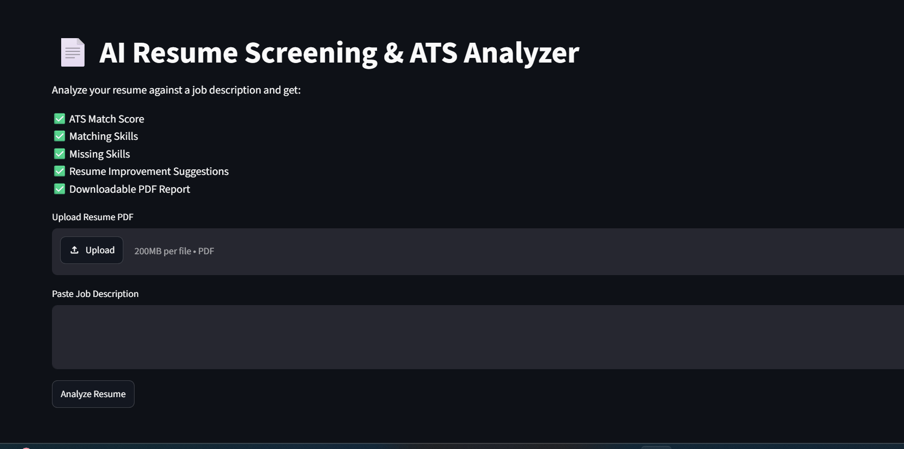
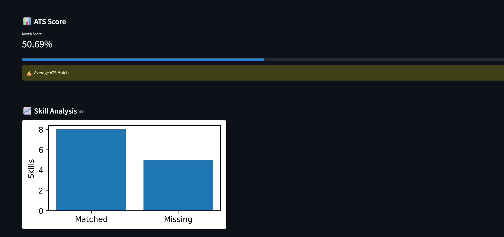
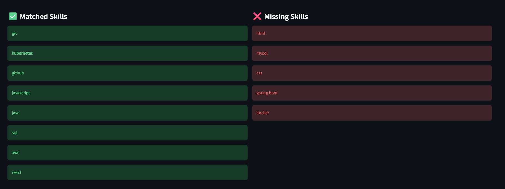
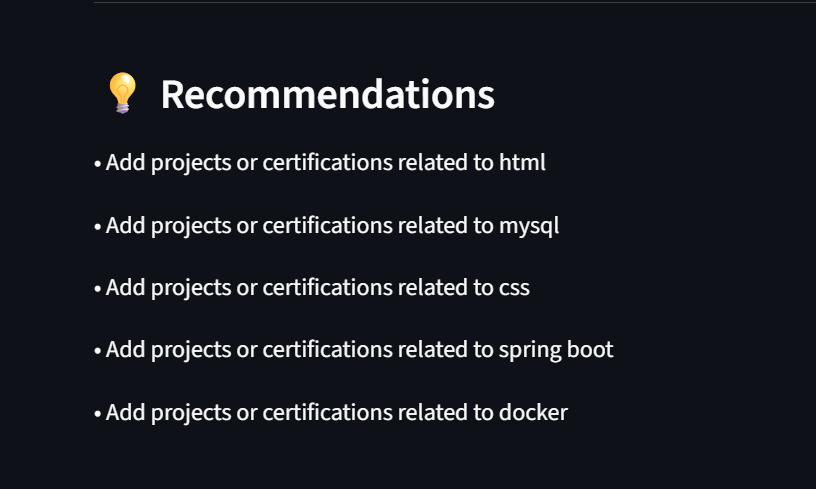
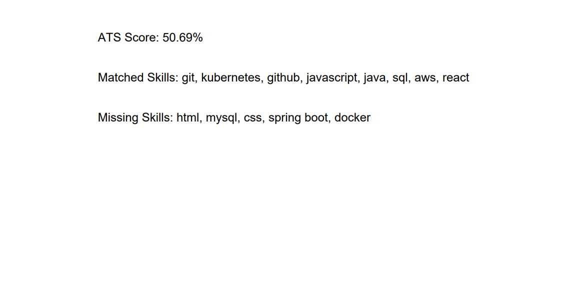

# 📄 AI Resume Screening & ATS Analyzer

## 🚀 Overview

AI Resume Screening & ATS Analyzer is a web application that evaluates resumes against job descriptions using Natural Language Processing (NLP) and Machine Learning techniques.

The system simulates how an Applicant Tracking System (ATS) works by analyzing resume content, identifying matching and missing skills, calculating an ATS score, and generating recommendations for improvement.

---

## ✨ Features

### Resume Analysis

* Upload Resume PDF
* Extract resume text automatically
* Parse and analyze resume content

### ATS Scoring

* Calculate ATS Match Score
* Combine skill matching and text similarity
* Display score using a progress meter

### Skill Analysis

* Identify matching skills
* Detect missing skills
* Visualize skill match statistics

### Recommendations

* Generate personalized improvement suggestions
* Highlight skills to learn or add

### Reporting

* Generate downloadable PDF reports
* Summarize ATS performance
* Export analysis results

### User Interface

* Interactive Streamlit dashboard
* Clean and responsive design
* Easy-to-use workflow

---

## 🛠️ Tech Stack

### Programming Language

* Python

### Libraries & Frameworks

* Streamlit
* Scikit-Learn
* PDFPlumber
* Pandas
* NumPy
* Matplotlib
* ReportLab

### Machine Learning & NLP

* TF-IDF Vectorization
* Cosine Similarity
* Skill-Based Matching

---

## 📂 Project Structure

```text
AI-Resume-Screening-System/

├── app.py
├── requirements.txt
├── README.md
├── .gitignore

├── assets/
│   └── skills_database.json

├── reports/

├── screenshots/
│   ├── home.png
│   ├── analysis.png
│   ├── recommendations.png
│   └── report_download.png

├── sample_resumes/

├── src/
│   ├── pdf_parser.py
│   ├── skill_extractor.py
│   ├── ats_score.py
│   ├── recommendation.py
│   └── report_generator.py
```

---

## 📸 Screenshots

### Home Page



### Resume Analysis





### Recommendations



### PDF Report Download



---

## ⚙️ Installation

### Clone Repository

```bash
git clone https://github.com/YOUR_USERNAME/AI-Resume-Screening-System.git
```

### Navigate to Project

```bash
cd AI-Resume-Screening-System
```

### Create Virtual Environment

```bash
python -m venv venv
```

### Activate Environment

Windows

```bash
venv\Scripts\activate
```

### Install Dependencies

```bash
pip install -r requirements.txt
```

### Run Application

```bash
streamlit run app.py
```

---

## 📊 How It Works

1. Upload a Resume PDF.
2. Paste a Job Description.
3. Click **Analyze Resume**.
4. The system:

   * Extracts resume text
   * Identifies skills
   * Calculates ATS score
   * Finds matching skills
   * Detects missing skills
   * Generates recommendations
5. Download the PDF report.

---

## 🎯 Future Enhancements

* Multi-Resume Ranking System
* Resume Comparison Dashboard
* AI-Powered Resume Suggestions
* Interview Question Generator
* Job Recommendation Engine
* Advanced NLP with spaCy
* Generative AI Feedback

---

## 📈 Resume Impact

This project demonstrates:

* Machine Learning Fundamentals
* Natural Language Processing
* Python Development
* Streamlit Application Development
* Software Design & Modular Architecture
* Data Processing and Visualization

---

## 👨‍💻 Author

**Parthiban**

Aspiring Java Full Stack Developer | Machine Learning Enthusiast

LinkedIn: https://www.linkedin.com/in/parthiban0328/
GitHub: https://github.com/parthiban0328